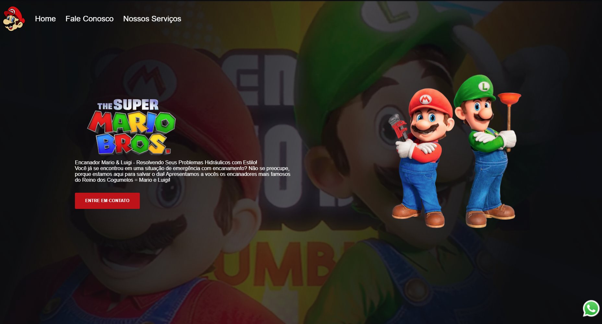

# Mario Bros.

## Sobre o projeto

Este projeto foi criado para praticar **HTML, CSS e JavaScript**. Com ele, é possível acessar whatsapp e mandar emails

## Demonstração

## Tecnologias

- HTML5
- CSS3
- JavaScript 

## O que pratiquei

- Organização de conteúdo com HTML
- Estilização e layout com CSS
- Funcionalides do JavaScript
